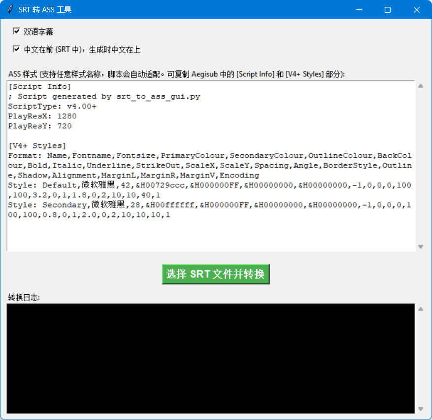

# SRT 转 ASS 工具

一个简单易用的图形化工具，用于将 SRT 字幕文件批量转换为 ASS（Advanced SubStation Alpha）格式字幕文件。支持双语字幕处理和完全自定义样式。

## 功能特点

- 🔄 **批量转换**：一次选择多个 SRT 文件进行转换
- 🌐 **双语支持**：智能处理中英双语字幕，支持语序调整
- 🎨 **自定义样式**：完全自定义字幕样式，支持直接复制 Aegisub 样式
- 🖥️ **图形界面**：直观易用的用户界面，无需命令行操作
- 📝 **实时日志**：显示转换进度和详细日志信息
- 🛡️ **错误处理**：完善的异常处理机制

## 系统要求

- Python 3.6+
- tkinter（通常随 Python 一起安装）

## 安装和运行

1. 确保已安装 Python 3.6 或更高版本
2. 下载 `srt2ass_gui.py` 文件
3. 在命令行中运行：
   ```bash
   python srt2ass_gui.py
   ```

## 使用教程



### 基本使用步骤

1. **启动程序**
   - 运行脚本后会打开图形界面窗口

2. **设置转换选项**
   - **双语字幕**：勾选此项表示 SRT 文件包含双语字幕（每两行为一对）
   - **中文在前**：勾选此项表示 SRT 文件中中文行在英文行前面，生成的 ASS 字幕中中文会显示在上方

3. **配置字幕样式**
   - 在"ASS 样式"文本框中输入或粘贴你的样式代码
   - 可以直接从 Aegisub 中复制完整的样式部分
   - 如果留空，将使用内置的默认样式

4. **开始转换**
   - 点击"选择 SRT 文件并转换"按钮
   - 在弹出的文件选择对话框中选择一个或多个 SRT 文件
   - 选择输出目录
   - 等待转换完成

### 样式自定义详解

#### 样式格式
ASS 样式遵循标准格式，包含以下部分：

```
[Script Info]
; 脚本信息部分
ScriptType: v4.00+
PlayResX: 1280
PlayResY: 720

[V4+ Styles]
Format: Name,Fontname,Fontsize,PrimaryColour,SecondaryColour,OutlineColour,BackColour,Bold,Italic,Underline,StrikeOut,ScaleX,ScaleY,Spacing,Angle,BorderStyle,Outline,Shadow,Alignment,MarginL,MarginR,MarginV,Encoding
Style: Default,微软雅黑,42,&H00729ccc,&H000000FF,&H00000000,&H00000000,-1,0,0,0,100,100,3.2,0,1,1.8,0,2,10,10,40,1
Style: Secondary,微软雅黑,28,&H00ffffff,&H000000FF,&H00000000,&H00000000,-1,0,0,0,100,100,0.8,0,1,2.0,0,2,10,10,10,1
```

#### 样式参数说明
- **Name**：样式名称（脚本会自动识别 Default 和 Secondary）
- **Fontname**：字体名称
- **Fontsize**：字体大小
- **PrimaryColour**：主要颜色（格式：&HAABBGGRR）
- **SecondaryColour**：次要颜色（用于卡拉 OK 效果）
- **OutlineColour**：边框颜色
- **BackColour**：背景颜色
- **Bold, Italic, Underline, StrikeOut**：字体样式（-1 表示开启，0 表示关闭）
- **ScaleX, ScaleY**：字体缩放比例
- **Spacing**：字符间距
- **Angle**：旋转角度
- **BorderStyle**：边框样式（1=边框+阴影，3=背景框）
- **Outline**：边框宽度
- **Shadow**：阴影深度
- **Alignment**：对齐方式（1=左下，2=中下，3=右下，等等）
- **MarginL, MarginR, MarginV**：左、右、垂直边距
- **Encoding**：字符编码（1=默认，134=简体中文）

#### 智能样式映射
脚本会自动识别和映射样式：
- 优先使用名为 "Default" 的样式作为主要样式
- 优先使用名为 "Secondary" 的样式作为次要样式
- 如果没有找到，则使用第一个和第二个可用样式
- 如果只有一个样式，双语字幕会共用同一个样式

### 双语字幕处理

#### 输入格式要求
SRT 文件中的双语字幕应该按以下格式排列：

```
1
00:00:01,000 --> 00:00:03,000
这是中文文本
This is English text

2
00:00:04,000 --> 00:00:06,000
第二句中文
Second English sentence
```

#### 处理逻辑
- 当启用"双语字幕"选项时，脚本会将每两行文本视为一对
- 根据"中文在前"选项决定中英文的显示位置
- 中文使用主要样式（通常在下方），英文使用次要样式（通常在上方）
- 如果某字幕块只有一行文本，则使用主要样式显示

### 默认样式

如果样式文本框为空，脚本会使用以下默认样式：

```
[Script Info]
; Script generated by srt_to_ass_gui.py
ScriptType: v4.00+
PlayResX: 1280
PlayResY: 720

[V4+ Styles]
Format: Name,Fontname,Fontsize,PrimaryColour,SecondaryColour,OutlineColour,BackColour,Bold,Italic,Underline,StrikeOut,ScaleX,ScaleY,Spacing,Angle,BorderStyle,Outline,Shadow,Alignment,MarginL,MarginR,MarginV,Encoding
Style: Default,Arial,36,&H00FFFFFF,&H000000FF,&H00000000,&H00000000,-1,0,0,0,100,100,0,0,1,2,2,2,10,10,40,1
Style: Secondary,Arial,24,&H00CCCCCC,&H000000FF,&H00000000,&H00000000,-1,0,0,0,100,100,0,0,1,2,2,2,10,10,10,1
```

### 输出文件

转换后的 ASS 文件会保存在指定的输出目录中，文件名与原始 SRT 文件相同，但扩展名改为 `.ass`。

### 日志信息

程序界面下方的日志区域会显示：
- 转换开始信息
- 每个文件的处理结果（成功/失败）
- 转换完成统计
- 错误信息（如果有）

## 常见问题

### Q: 如何从 Aegisub 复制样式？
A: 在 Aegisub 中打开字幕文件，进入样式管理器，选择所有样式，复制后粘贴到本工具的样式文本框中。

### Q: 为什么转换后的字幕样式不对？
A: 请检查样式格式是否正确，特别是 `Style:` 行的参数数量和格式。

### Q: 支持哪些字符编码？
A: 脚本使用 UTF-8 编码读取 SRT 文件，使用 UTF-8 with BOM 编码写入 ASS 文件，确保最大兼容性。

### Q: 可以为不同字幕使用不同样式吗？
A: 当前版本中，所有字幕使用相同的样式配置。如需不同样式，建议分别处理。

## 技术细节

- **输入格式**：SRT (SubRip Text)
- **输出格式**：ASS (Advanced SubStation Alpha)
- **编码支持**：UTF-8 输入，UTF-8 with BOM 输出
- **时间格式**：自动转换 SRT 时间格式到 ASS 时间格式
- **批处理**：支持一次处理多个文件

## 许可证

此工具可自由使用和修改。

## 更新日志

- v1.0: 初始版本，支持基本的 SRT 到 ASS 转换
- 支持双语字幕处理
- 支持自定义样式
- 图形界面操作